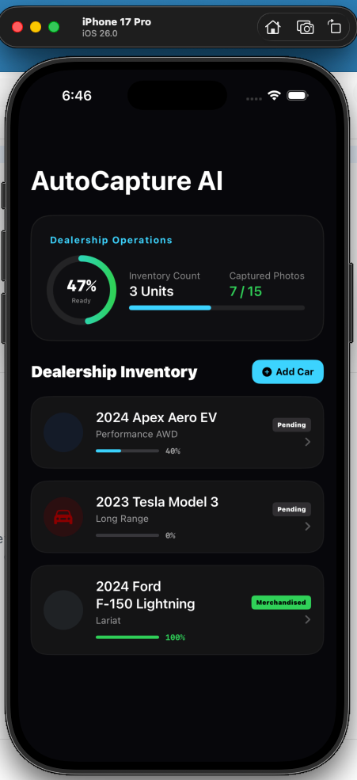

# AutoCapture AI - Smart Vehicle Merchandising Companion

AutoCapture AI is a premium, high-fidelity iOS application built using **SwiftUI** and the **MVVM (Model-View-ViewModel)** architectural pattern. It is designed to assist dealership operators and automotive lot inspectors in capturing standardized, high-quality vehicle merchandising photographs.



---

## 🚀 Key Features

*   **Dealership Operations Dashboard**: A sleek, dark-themed dashboard presenting key analytics (total inventory counts, photos captured, readiness rate) alongside interactive progress gauges.
*   **Level & Stabilizer Guide**: An accelerometer-simulated leveling bubble overlaying the camera viewfinder. Tapping helper utilities centers the stabilizer, which glows green when aligned.
*   **Dynamic Viewfinder Silhouettes**: Lightweight, vector-rendered outlines (Front-Left 3/4, Front Profile, Side Profile, Rear 3/4, Dashboard Odometer) drawn using SwiftUI `Path` components to guide framing.
*   **Core ML Quality Auditing**: Emulates a multi-stage machine learning inference checks:
    *   *Image Sharpness / Blur* (Audits high-frequency edge metrics)
    *   *Lighting & Exposure* (Validates optimal exposure range)
    *   *Grid Framing Alignment* (Checks positioning accuracy against guide wireframes)
    *   *Background Surrounding* (Classifies scenes as clean lot, messy environment, or high contrast)
*   **Dynamic Visual Mockups**: Renders color-matched vector car thumbnails in the gallery matching your vehicle's paint color hex codes.
*   **Manual Overrides**: Incorporates override controls for managers to approve borderline photos manually.

---

## 🛠 Architectural Design (MVVM Pattern)

The application separates concerns cleanly across three layers:

```
  ┌─────────────────────────────────────────────────────────────┐
  │                           VIEWS                             │
  │  (DashboardView, CaptureCameraView, AIQualityCheckView)     │
  └──────────────┬──────────────────────────────▲───────────────┘
                 │ (User Actions)               │ (Data Bindings)
                 ▼                              │
  ┌─────────────────────────────────────────────┴───────────────┐
  │                        VIEW MODEL                           │
  │                   (CaptureViewModel)                        │
  └──────────────┬──────────────────────────────▲───────────────┘
                 │ (Updates State)              │ (Fetches Data)
                 ▼                              │
  ┌─────────────────────────────────────────────┴───────────────┐
  │                          MODELS                             │
  │           (Vehicle, CaptureGuide, QualityMetrics)           │
  └─────────────────────────────────────────────────────────────┘
```

*   **Model Layer (`Models.swift`)**: Encapsulates immutable states conforming to `Codable`, `Equatable`, and `Hashable` for swift integration with modern SwiftUI `NavigationStack` architectures.
*   **ViewModel Layer (`CaptureViewModel.swift`)**: Drives simulated sensor feeds (gyro drift), coordinates UI camera filters (zoom, flash), runs async Core ML pipelines, and caches lot inventories.
*   **View Layer**: Composes modular layouts styled with curated gradients, blur backings, and visual micro-animations.

---

## 📂 Code Layout

*   [Models.swift](file:///Users/monzurulehsan/lab_v2/car-automation/car-automation/Models.swift): Data structures.
*   [CaptureViewModel.swift](file:///Users/monzurulehsan/lab_v2/car-automation/car-automation/CaptureViewModel.swift): State machine and background scheduler simulation.
*   [DashboardView.swift](file:///Users/monzurulehsan/lab_v2/car-automation/car-automation/DashboardView.swift): Main entry hub displaying dealer analytics.
*   [CaptureCameraView.swift](file:///Users/monzurulehsan/lab_v2/car-automation/car-automation/CaptureCameraView.swift): Interactive camera simulator.
*   [AIQualityCheckView.swift](file:///Users/monzurulehsan/lab_v2/car-automation/car-automation/AIQualityCheckView.swift): Core ML progress analyzer overlay.
*   [VehicleGalleryView.swift](file:///Users/monzurulehsan/lab_v2/car-automation/car-automation/VehicleGalleryView.swift): Dealer portfolio grids displaying vector wireframes.
*   [ContentView.swift](file:///Users/monzurulehsan/lab_v2/car-automation/car-automation/ContentView.swift): Directs routing context in dark mode.

---

## ⚡ Setup & Compilation

### Requirements
*   Xcode 16.0+
*   iOS 17.0+ Target SDK
*   Swift 5.10+

### Compilation
To compile the application using command-line developer tools, run the following command from the project root:

```bash
xcodebuild -project car-automation.xcodeproj -scheme car-automation -sdk iphonesimulator build
```
